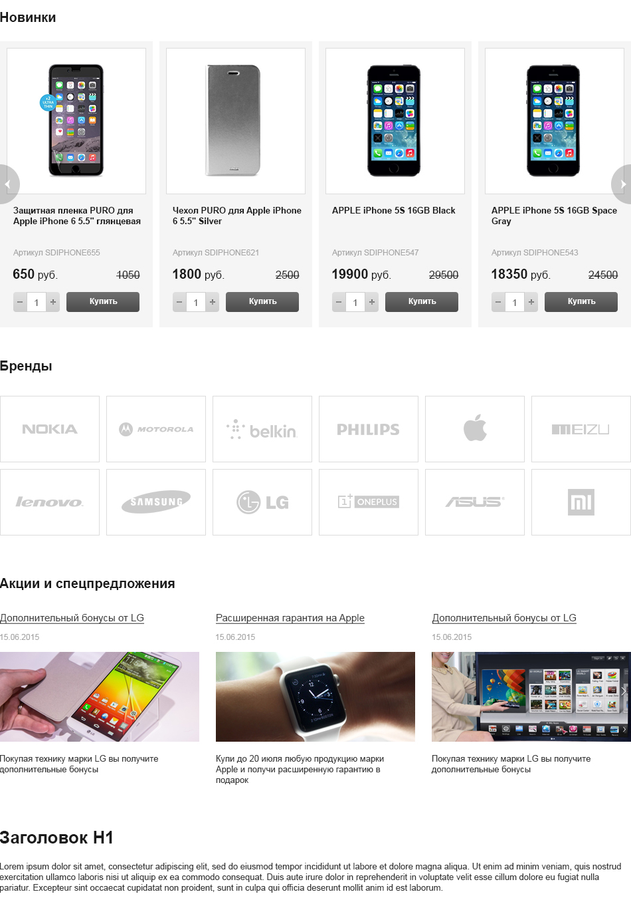

# Задание 1

Дано:
 
```html
<!DOCTYPE html>
<html>
    <head>
    </head>
    <body>
    </body>
</html>
```

> Вставьте приведённые ниже тэги в код сверху в соответствии с правилами их размещения, если какой тэг можно разместить в нескольких местах опишите

```html
<meta charset="utf-8">
<script src="external.js"></script>
<p>Раньше термин «компьютерная грамотность» по своей сути означал умение работать с офисным пакетом, но жизнь не стоит на месте, и теперь всё больше экспертов заявляют о том, что крайне важным навыком для широкого круга людей становится умение программировать.</p>
<link rel="stylesheet" href="style.css">
<h1>Почему всё больше «не-технарей» изучают вёрстку</h1>
<meta name="description" content="краткое описание">
<p>При этом программирование — огромная область знаний, только небольшая часть которой может действительно пригодиться обычному человеку (то есть «не-технарю»). Мы считаем, что основу «новой компьютерной грамотности» должно составить знание вёрстки. В сегодняшнем топике мы рассмотрим примеры того, как изучение веб-технологий может помочь представителям не-технических профессий.</p>
<meta name="keywords" content="разные, ключевые, слова">
<p>Прочитать <a href="https://habr.com/" target="_blank" rel="nofollow noopener">статью целиком</a> вы можете на Хабре.</p>
```
# Задание 2

> Необходимо разобрать представленный макет на блоки и элементы в соответствии с **БЭМ**, придумать им названия.



